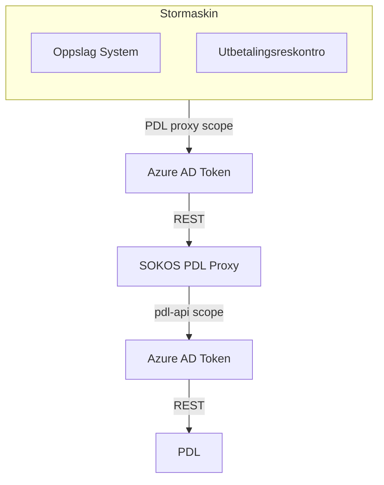
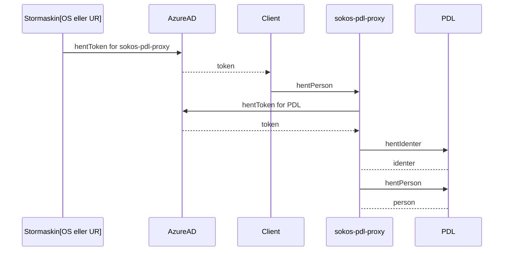

# System-Arkitetktur

```mermaid
flowchart TB

subgraph k1 [Stormaskin]
  direction TB
  OS[Oppslag System]     
  UR[Utbetalingsreskontro]     
end


k1 --> |PDL proxy scope| AADT[Azure AD Token]
AADT --> |REST| SPP
SPP[SOKOS PDL Proxy] --> |pdl-api scope| AAD[Azure AD Token]
AAD --> |REST| PDL


```
---

## Flow Diagram

```mermaid

sequenceDiagram
    
    Stormaskin[OS eller UR]->>AzureAD: hentToken for sokos-pdl-proxy
    AzureAD-->>Client: token
    Client->>sokos-pdl-proxy: hentPerson
    sokos-pdl-proxy->>AzureAD: hentToken for PDL
    AzureAD-->>sokos-pdl-proxy: token
    sokos-pdl-proxy->>PDL: hentIdenter
    PDL-->sokos-pdl-proxy: identer
    sokos-pdl-proxy->>PDL: hentPerson
    PDL-->sokos-pdl-proxy: person
    
```